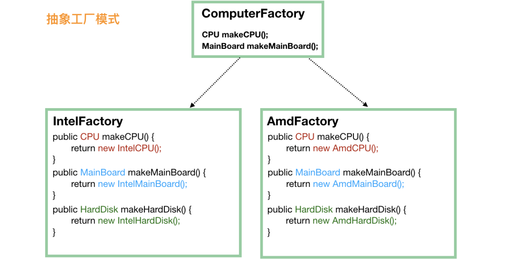

##创建型模式
简单工厂模式最简单；工厂模式在简单工厂模式的基础上增加了选择工厂的维度，需要第一步选择合适的工厂；抽象工厂模式有产品族的概念，如果各个产品是存在兼容性问题的，就要用抽象工厂模式。单例模式就不说了，为了保证全局使用的是同一对象，一方面是安全性考虑，一方面是为了节省资源；建造者模式专门对付属性很多的那种类，为了让代码更优美；原型模式用得最少，了解和 Object 类中的 clone() 方法相关的知识即可。
###简单工厂模式
```java
public class FoodFactory {

    public static Food makeFood(String name) {
        if (name.equals("noodle")) {
            Food noodle = new LanZhouNoodle();
            noodle.addSpicy("more");
            return noodle;
        } else if (name.equals("chicken")) {
            Food chicken = new HuangMenChicken();
            chicken.addCondiment("potato");
            return chicken;
        } else {
            return null;
        }
    }
}
```
###工厂方法模式
```java
public interface FoodFactory {
    Food makeFood(String name);
}
public class ChineseFoodFactory implements FoodFactory {

    @Override
    public Food makeFood(String name) {
        if (name.equals("A")) {
            return new ChineseFoodA();
        } else if (name.equals("B")) {
            return new ChineseFoodB();
        } else {
            return null;
        }
    }
}
public class AmericanFoodFactory implements FoodFactory {

    @Override
    public Food makeFood(String name) {
        if (name.equals("A")) {
            return new AmericanFoodA();
        } else if (name.equals("B")) {
            return new AmericanFoodB();
        } else {
            return null;
        }
    }
}
```
###抽象工厂模式
同品牌、族群一个工厂


###单例模式
####饿汉模式：
```java
public class Singleton {
    // 首先，将 new Singleton() 堵死
    private Singleton() {};
    // 创建私有静态实例，意味着这个类第一次使用的时候就会进行创建
    private static Singleton instance = new Singleton();

    public static Singleton getInstance() {
        return instance;
    }
    // 瞎写一个静态方法。这里想说的是，如果我们只是要调用 Singleton.getDate(...)，
    // 本来是不想要生成 Singleton 实例的，不过没办法，已经生成了
    public static Date getDate(String mode) {return new Date();}
}
```
####饱汉模式：
```java
public class Singleton {
    // 首先，也是先堵死 new Singleton() 这条路
    private Singleton() {}
    // 和饿汉模式相比，这边不需要先实例化出来，注意这里的 volatile，它是必须的
    private static volatile Singleton instance = null;

    public static Singleton getInstance() {
        if (instance == null) {
            // 加锁
            synchronized (Singleton.class) {
                // 这一次判断也是必须的，不然会有并发问题
                if (instance == null) {
                    instance = new Singleton();
                }
            }
        }
        return instance;
    }
}
```
#####双重检查锁为什么要使用volatile字段
```text
从字节码可以看到创建一个对象实例，可以分为三步：
1.分配对象内存
2.调用构造器方法，执行初始化
3.将对象引用赋值给变量

虚拟机实际运行时，以上指令可能发生重排序。
以上代码 2,3 可能发生重排序，但是并不会重排序 1 的顺序。也就是说 1 这个指令都需要先执行，因为 2,3 指令需要依托 1 指令执行结果。

Java 语言规规定了线程执行程序时需要遵守 intra-thread semantics。**intra-thread semantics ** 保证重排序不会改变单线程内的程序执行结果。这个重排序在没有改变单线程程序的执行结果的前提下，可以提高程序的执行性能。

虽然重排序并不影响单线程内的执行结果，但是在多线程的环境就带来一些问题。

多线程环境下可能，线程B if (object == null) 此时判断逻辑可能为true，但由于指令重排序，可能对象未调用构造方法初始化，造成空异常
```

####内部类
```java
public class Singleton3 {

    private Singleton3() {}
    // 主要是使用了 嵌套类可以访问外部类的静态属性和静态方法 的特性
    private static class Holder {
        private static Singleton3 instance = new Singleton3();
    }
    public static Singleton3 getInstance() {
        return Holder.instance;
    }
}
```

####枚举
最后，我们说一下枚举，枚举很特殊，它在类加载的时候会初始化里面的所有的实例，而且 JVM 保证了它们不会再被实例化，所以它天生就是单例的。


###建造者模式
```java
public class ReportDeficiencyReQcChainBuilder {

    private ReportDeficiencyReQcChain head;
    private ReportDeficiencyReQcChain tail;

    public ReportDeficiencyReQcChainBuilder addChain(ReportDeficiencyReQcChain chain) {
        if (head == null) {
            head = tail = chain;
            return this;
        }
        tail.setNextChain(chain);
        tail = chain;
        return this;
    }

    public ReportDeficiencyReQcChain build() {
        return head;
    }
}

ReportDeficiencyReQcChainBuilder builder = new ReportDeficiencyReQcChainBuilder();
for () {
    builder.addChain();
}
```

###原型模式
原型模式很简单：有一个原型实例，基于这个原型实例产生新的实例，也就是“克隆”了。
Object 类中有一个 clone() 方法，它用于生成一个新的对象，当然，如果我们要调用这个方法，java 要求我们的类必须先实现 Cloneable 接口，此接口没有定义任何方法，但是不这么做的话，在 clone() 的时候，会抛出 CloneNotSupportedException 异常。
protected native Object clone() throws CloneNotSupportedException;

Java 的克隆是浅克隆，碰到对象引用的时候，克隆出来的对象和原对象中的引用将指向同一个对象。通常实现深克隆的方法是将对象进行序列化，然后再进行反序列化。

##结构型
通过改变代码结构来达到解耦的目的，使得我们的代码容易维护和扩展。
###代理模式
既然说是代理，那就要对客户端隐藏真实实现，由代理来负责客户端的所有请求。当然，代理只是个代理，它不会完成实际的业务逻辑，而是一层皮而已，但是对于客户端来说，它必须表现得就是客户端需要的真实实现。
```java
public interface FoodService {
    Food makeChicken();
    Food makeNoodle();
}

public class FoodServiceImpl implements FoodService {
    public Food makeChicken() {
          Food f = new Chicken();
        f.setChicken("1kg");
          f.setSpicy("1g");
          f.setSalt("3g");
        return f;
    }
    public Food makeNoodle() {
        Food f = new Noodle();
        f.setNoodle("500g");
        f.setSalt("5g");
        return f;
    }
}

// 代理要表现得“就像是”真实实现类，所以需要实现 FoodService
public class FoodServiceProxy implements FoodService {

    // 内部一定要有一个真实的实现类，当然也可以通过构造方法注入
    private FoodService foodService = new FoodServiceImpl();

    public Food makeChicken() {
        System.out.println("我们马上要开始制作鸡肉了");

        // 如果我们定义这句为核心代码的话，那么，核心代码是真实实现类做的，
        // 代理只是在核心代码前后做些“无足轻重”的事情
        Food food = foodService.makeChicken();

        System.out.println("鸡肉制作完成啦，加点胡椒粉"); // 增强
          food.addCondiment("pepper");

        return food;
    }
    public Food makeNoodle() {
        System.out.println("准备制作拉面~");
        Food food = foodService.makeNoodle();
        System.out.println("制作完成啦")
        return food;
    }
}
```

###适配器模式
类适配和对象适配的异同：

一个采用继承，一个采用组合；
类适配属于静态实现，对象适配属于组合的动态实现，对象适配需要多实例化一个对象；
总体来说，对象适配用得比较多。

####适配器模式和代理模式的异同
```text
适配器模式和代理模式的异同：比较这两种模式，其实是比较对象适配器模式和代理模式，在代码结构上，它们很相似，都需要一个具体的实现类的实例。
但是它们的目的不一样，代理模式做的是增强原方法的活；适配器做的是适配的活，为的是提供“把鸡包装成鸭，然后当做鸭来使用”，而鸡和鸭它们之间原本没有继承关系。
```
###桥接模式

###装饰器模式
红茶、绿茶
金桔红茶、金桔绿茶、柠檬红茶、柠檬绿茶、金桔柠檬红茶（两层包装）

InputStream、OutputStream
```text
我们知道 InputStream 代表了输入流，具体的输入来源可以是文件（FileInputStream）、管道（PipedInputStream）、数组（ByteArrayInputStream）等，这些就像前面奶茶的例子中的红茶、绿茶，属于基础输入流。
FilterInputStream 承接了装饰模式的关键节点，它的实现类是一系列装饰器，比如 BufferedInputStream 代表用缓冲来装饰，也就使得输入流具有了缓冲的功能，
LineNumberInputStream 代表用行号来装饰，在操作的时候就可以取得行号了，DataInputStream 的装饰，使得我们可以从输入流转换为 Java 中的基本类型值。
```
####装饰器模式和代理模式
```text
从名字来简单解释下装饰器。既然说是装饰，那么往往就是添加小功能这种，而且，我们要满足可以添加多个小功能。最好还类似的品种
最简单的，代理模式就可以实现功能的增强，但是代理不容易实现多个功能的增强，当然你可以说用代理包装代理的多层包装方式，但是那样的话代码就复杂了。
```

###门面模式
门面模式（也叫外观模式，Facade Pattern）在许多源码中有使用，比如 SLF4J 就可以理解为是门面模式的应用。这是一个简单的设计模式，我们直接上代码再说吧。
Controller也是
###组合模式
###享元模式

###结构型模式总结

前面，我们说了代理模式、适配器模式、桥梁模式、装饰模式、门面模式、组合模式和享元模式。读者是否可以分别把这几个模式说清楚了呢？在说到这些模式的时候，心中是否有一个清晰的图或处理流程在脑海里呢？

代理模式是做方法增强的，适配器模式是把鸡包装成鸭这种用来适配接口的，桥梁模式做到了很好的解耦，装饰模式从名字上就看得出来，适合于装饰类或者说是增强类的场景，门面模式的优点是客户端不需要关心实例化过程，只要调用需要的方法即可，组合模式用于描述具有层次结构的数据，享元模式是为了在特定的场景中缓存已经创建的对象，用于提高性能。

##行为型模式
行为型模式关注的是各个类之间的相互作用，将职责划分清楚，使得我们的代码更加地清晰。
###策略模式
###观察者模式
###责任链模式
###模板方法模式
###状态模式
###行为型模式总结
行为型模式部分介绍了策略模式、观察者模式、责任链模式、模板方法模式和状态模式，其实，经典的行为型模式还包括备忘录模式、命令模式等，但是它们的使用场景比较有限，而且本文篇幅也挺大了，我就不进行介绍了。