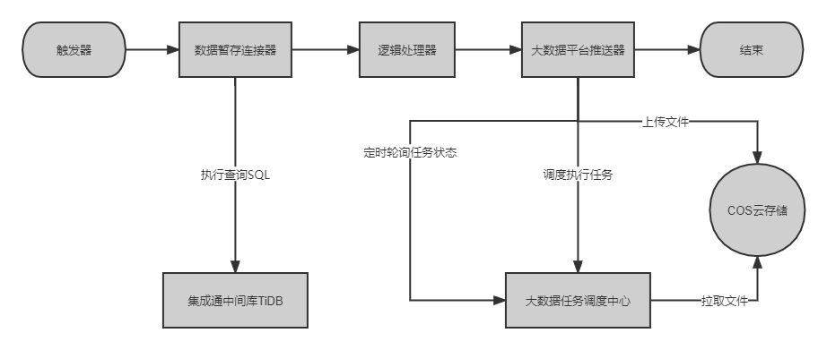
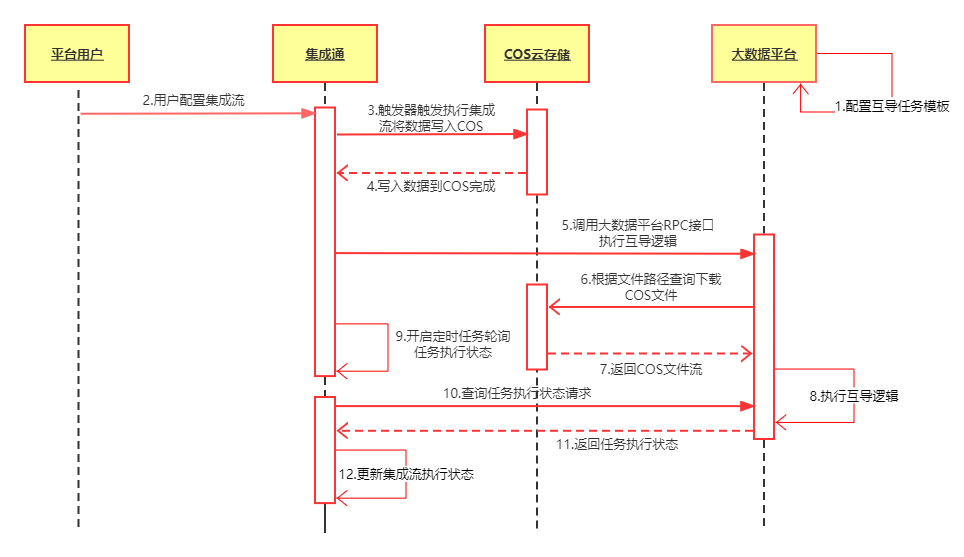

#集成通&大数据平台打通方案
##1 背景说明
目前大数据平台和集成通是各自执行任务，研发人员在大数据平台(https://star-data.dmall.com/)配置数据互导任务。
一方面，把hive数据同步到mysql，同时集成通配置集成流定时从该mysql库拉取数据同步给商家。
另一方面，把mysql或cos数据同步到hive，同时集成通配置集成流定时从商家侧拉取数据同步到mysql或cos。
带来的问题：无法形成一个完整的产品线。
1.需要手动在大数据平台配置互导任务
2.运维成本增加，当大数据平台的互导任务失败后，集成通无法感知，只能通过告警来通知相关人员，最后在重新手动执行
##2 需求说明
把集成通和大数据平台打通，只需要在集成通中配置集成流，传入执行的SQL或配置表名称(需审核)，无需再大数据平台配置。
##3 实现方案
###3.1 从大数据平台Hive查询数据
1.首先在大数据平台部署一个执行器(上传jar)
2.用户在集成通中配置集成流时，调用大数据平台的创建任务接口
3.触发器定时执行，传入任务id和执行sql，在上传的执行器中执行，把结果写入cos
4.集成通监听大数据平台任务执行完成的mq(或轮询调用查询状态接口)
5.当监听到大数据平台的任务执行完毕后，从cos拉取文件解析数据
6.把cos文件数据推送给商家，整个集成流执行完毕

###3.2 写入数据到大数据平台Hive
1.首先在大数据平台创建一个通用互导任务模板(COS互导到Hive)
2.用户配置集成流从数据库或FTP抓取数据经过处理写入COS文件(触发器-->数据暂存连接器-->模板逻辑处理器-->大数据平台推送器)
3.集成通大数据平台推送器写入COS文件结束时调用任务中台的任务调度执行接口将COS数据写入Hive数据中台-任务调度接口
4.定时轮询调用任务中台的任务调度执行状态查询接口，然后更新集成流的执行状态
5.COS文件存储路径以及命名规则：
   存储路径：/integration/${vendorId}/hive-input/${fileName}
   命名规则：${flowId}_{yyyyMMddHHmmss}.csv
   文件格式：没有文件头、逗号分割、字段顺序与大数据Hive字段顺序一致
6.大数据平台推送器界面主要配置：Hive表名称

