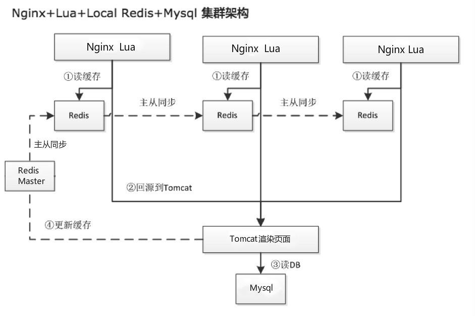

Nginx作用：高性能负载均衡Http反向代理服务器
在dshop里是如何应用的？
前端调用被Nginx反向代理后的域名及接口地址，访问Nginx服务器下的资源
cat /web/servers/openresty/nginx/conf/nginx.conf
该配置文件并没有配置任何代理及接口相关，寻找是否include引入其他配置文件
cat /web/servers/openresty/nginx/conf/nginx.conf | grep 'include'

include       mime.types;
        include resolvers.conf;
include domains/*.conf;
依次查看这些配置文件，最终发现domains/dmall.com.conf中含有具体接口地址路径以及资源映射关系
例如进入dshop页时抓包看到的/act接口，映射/usr/local/openresty/nginx/html/dshop.lua;该脚本
cat /web/servers/openresty/nginx/conf/domains/dmall.com.conf

以下只截取核心配置
server
{
#域名a.dmall.com
 listen 80;
 server_name a.dmall.com;
 charset utf-8;
 index index.html index.htm;
 # lua_code_cache off;
 # dshop活动页访问接口地址
 location ^~ /act/ {
 etag on;
 content_by_lua_file /usr/local/openresty/nginx/html/dshop.lua;
 }
......
 ##2020-07-21 李全亮
 location = /storeGroupProxy {
 internal;
 proxy_next_upstream http_500 http_502 http_503 http_504 error timeout invalid_header;
 proxy_set_header Host $host;
 proxy_set_header X-Forwarded-For $http_x_forwarded_for;
 proxy_pass http://tomcat;
 }
......
dshop.lua
只截取核心代码

#从redis读取缓存，如果存在则直接返回结果
pageInfo = read_redis_pwd(redisHost, redisPort, redisPassword, { pageInfoKey })
if pageInfo then
    if elapsed then
        local ok, err = lock:unlock()
        if not ok then
            ngx_log(ngx_ERR, "##[dshop]##, failed to unlock: ", err)
            --return ngx_exit(500)
        end
    end
    -- 打印日志
    ngx.update_time()
    _printQueryLog(common_params, "0-命中redis缓存2, 耗时:[" .. (ngx.now() - begin) ..']')
    ngx.say(pageInfo)
    return
end

#redis缓存不存在则读取/pageProxy接口获取数据，tomcat获取数据时会写入redis缓存
pageInfo = read_http("/pageProxy", common_params)
if not pageInfo or pageInfo == "error" then

    if elapsed then
        local ok, _err = lock:unlock()
        if not ok then
            ngx_log(ngx_ERR, "##[dshop]##, failed to unlock: ", _err)
            --return ngx_exit(500)
        end
    end
    -- 打印日志
    _printQueryLog(common_params, "1006-渲染页面信息pageInfo失败")
    local context = { code = "1006", redirectUrl = actData.redirectUrl, locationImg = actData.locationImg, locationImgUrl = actData.locationImgUrl }
    template.render("inspect.html", context)
    return
首先 Nginx 通过 Lua 读取本机 Redis 缓存，命中则返回，如果不命中才回源到后端 Tomcat ；Tomcat 再读取 Mysql 数据库进行页面渲染，同时将渲染结果回写到Redis中。

Nginx + Lua 天下武功，为快不破。Nginx 的看家本领就是速度，Lua 的拿手好戏亦是速度，这两者的结合在速度上无疑有基因上的优势。最先将 Nginx，Lua 组合到一起的是 OpenResty，它有一个 ngx_lua 模块，将 Lua 嵌入到了 Nginx 里执行。
OpenResty 是一个基于 Nginx 与 Lua 的高性能 Web 平台，它打包了标准的 Nginx 核心，其内部集成了大量精良的 Lua 库、第三方模块以及大多数的依赖项。充分利用 Nginx 的事件模型来进行非阻塞 I/O 通信，可以很方便地搭建能够处理超高并发、扩展性极高的动态 Web 应用。
openresty官网：http://openresty.org/cn/

