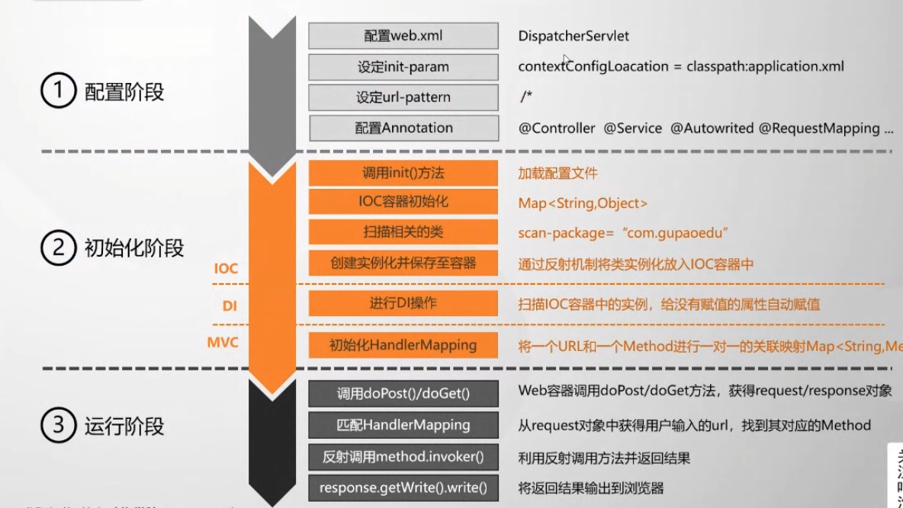

# Spring

## Why Spring?

Spring makes programming Java quicker, easier, and safer for everybody. Spring’s focus on speed, simplicity, and productivity has made it the world's most popular Java framework.

## Spring特性

#### OOP

Object Oriented Programming（面向对象编程）

封装、继承、多态

#### BOP

Bean Oriented Programming（面向Bean编程）

一切从Bean开始

#### AOP

Aspect Oriented Programming（面向切面编程）

解耦

#### IOC

Inversion of Control（控制反转）

将new对象的动作交由Spring做，并使用IOC容器保存已创建的对象

#### DI/DL

Dependency Injection（依赖注入） or Dependency Lookup（依赖查找）

Spring不仅管理自己创建的对象，而且保存对象与对象间的关系。注入赋值

构造注入、set方法注入、直接为属性赋值

##Spring版本
###1.x
XML配置
###2.5x
提供@Component、@Service、@Controller、@Repository等注解
###3.x
提供了@Configuration注解
去XML化配置
###4.x
提供了@Conditional注解
条件配置

## 注解

### 配置组件

#### @Configuration

把加了该注解的类作为一个IOC容器，如果他的某个方法上加了@Bean，会作为Spring容器中的Bean

#### @Bean

一个Bean注入到SpringIOC容器中

#### @ComponentScan

在配置类上添加该注解，默认会扫描该类所在包下的所有配置类

#### @Scope

用于指定作用域

#### @Lazy

延时加载

#### @Conditional

满足条件装配。Spring4开始支持

#### @Import

导入外部资源

#### @PostConstruct

生命周期，构造器初始化完成后

#### @PreDestory

生命周期，Bean销毁前

#### @DependsOn

生命周期，定义Bean初始化以及销毁时的顺序

#### Ioc容器注册Bean的方式

1.@Configuration中的@Bean

2.@ComponentScan扫描@Controller、@Service、@Repository、@Component、@Bean

3.@Import导入（bean名称是全类名）

​	1.@Import(xxx.class)

​	2.实现ImportSelector 自定义规则

​	3.实现ImportBeanDefinitionRegistrar，实现的registerBeanDefinitions()方法中可以获得BeanDefinitionRegistry，可是使用它直接向Ioc容器中注入Bean

4.把需要注册到IOC容器中的对象封装成FactoryBean

​	FactoryBean的作用是将Bean注册到IOC容器中

​	BeanFactoryBean的作用是从IOC容器中获得Bean（ApplicationContext就是BeanFactory）

#### 单个Bean的生命周期

1.Bean注解指定

```java
@Bean(initMethod = "refuelTheTrain", destroyMethod = "destoryTheTrain") 
```

2.实现接口。需要泛化，耦合度高

```java
class Car implements InitializingBean, DisposableBean 
```

3.@PostConstruct、@PreDestroy  注解方式

```java
@PostConstruct
public void createAirPlan() {
    System.out.println("create airPlan");
}

@PreDestroy
public void destroyAirPlan() {
    System.out.println("destroy airPlan");
}
```

#### 全局Bean创建的前后

实现BeanPostProcessor接口

需要对全局所有bean创建前后做增强动作的时候使用

```java
@Component
public class MyBeanPostProcessor implements BeanPostProcessor {
}
```

ApplicationContextAware接口可以拿到ApplicationContext上下文

### 赋值组件（自动装配）

#### @Value

1.支持基本数据类型、String类型 @Value("hahaha")

2.支持Spring EL表达式 @Value("#{8-5}")

3.支持配置文件中读取 @Value(${xxx})


#### @PropertySource

```
@PropertySource
```

### 织入组件

### 切面组件


## 手写Spring




## Spring Boot
```text
外部配置加载顺序SpringBoot也可以从以下位置加载配置：

优先级从高到低，高优先级的配置覆盖低优先级的配置，所有的配置会形成互补配置 。

命令行参数。所有的配置都可以在命令行上进行指定；
来自java:comp/env的JNDI属性；
Java系统属性（System.getProperties()）；
操作系统环境变量 ；
jar包外部的application-{profile}.properties或application.yml(带spring.profile)配置文件
jar包内部的application-{profile}.properties或application.yml(带spring.profile)配置文件，再来加载不带profile
jar包外部的application.properties或application.yml(不带spring.profile)配置文件
jar包内部的application.properties或application.yml(不带spring.profile)配置文件
@Configuration注解类上的@PropertySource
```